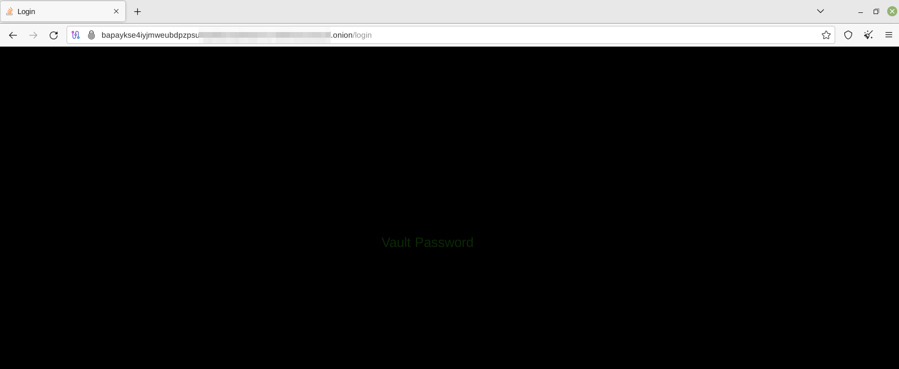

# Tor de Force

This is just a small project that was created after getting inspired from NetCraft's Dark Markets workshop.

The primary focus is developing some small modules to help fingerprint/deanonymize servers on the dark web.

However, during development it was necessary to learn how to create an actual dark web server. 

## Server

As part of this I built a small little challenge for anyone visiting this repository. 

It's a fairly easy challenge that a little requires code analysis and lateral thinking in order to leak the 'real' IP address of the server.

Unfortunately I am not currently hosting this server remotely, so in order to test the challenge you will need to run the server yourself. 



> I am working on Docker-fying this repo, which should make things easier to install. Progress TBC

```sh
# Make sure necessary permissions are set on /opt directory

git clone https://github.com/Bumpk1n/TorDeForce /opt/TorDeForce
python3 -m pip install -r /opt/TorDeForce/requirements.txt

# Set more restrictive permissions so Tor works
chmod 700 /opt/TorDeForce/server

# Start the server
python3 /opt/TorDeForce/server/app.py &
tor -f /opt/TorDeForce/server/torrc & sleep 5; echo -e "\nTor Domain: $(cat /opt/TorDeForce/server/hostname)\n"; fg
```

## Client

Current Modules:
- IP search using Regex
- Fingerprint HTTPs certificates
- Fingerprint SSH certificates
- Fingerprint Favicon hash

## Further Reading

[Caronte Automated Tool](https://dl.acm.org/doi/abs/10.1145/2810103.2813667)
[Tor De-anonymisation Techniques](https://link.springer.com/chapter/10.1007/978-3-319-64701-2_52)
[De-anonymisation Trawling](https://ieeexplore.ieee.org/abstract/document/6547103)
[POSTER: Fingerprinting Tor Hidden Services](https://www.researchgate.net/publication/310821261_POSTER_Fingerprinting_Tor_Hidden_Services)
[Deanonymize Tor](https://www.slideshare.net/FabrizioFarinacci1/deanonymize-tor-hidden-services-76463821)